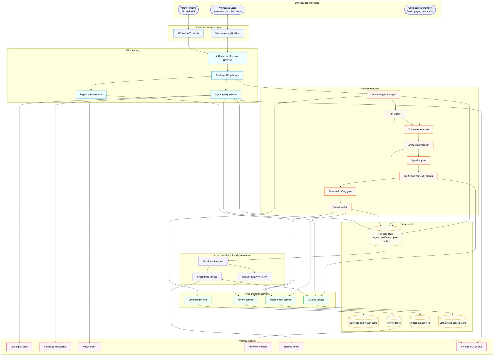
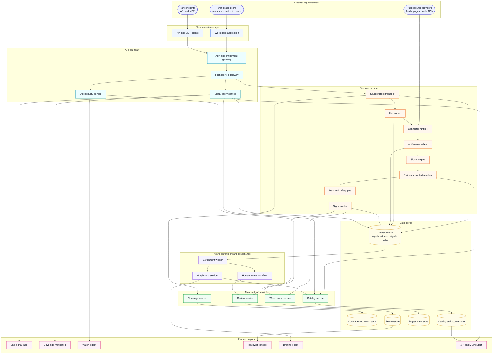

# Firehose MVP System Architecture

Status: Draft Date: 2026-07-05 Owner: Rebuilding America Project

## Purpose

This is the structural system diagram for the Firehose MVP. It shows concrete
runtime components, data stores, external dependencies, and product surfaces at
an architecture level. Arrows show the primary dependency or call direction.

Rendered PNG:

## Diagram

## Runtime Dependency Summary

- Workspace users interact with a single workspace application.
- The workspace application exposes live tape, coverage monitoring, digest, and
  briefing experiences.
- All private workspace calls pass through the auth and entitlement gateway.
- Firehose management configures source targets and hot monitoring.
- The hot worker claims due source targets, calls connector runtime, and stores
  immutable artifacts.
- The signal engine classifies artifacts, resolves context, applies the trust
  gate, and sends route decisions to the signal router.
- The signal router writes side effects through existing Atlas platform services
  rather than bypassing catalog, watch, or review rules.
- Data stores are separated by responsibility: Firehose, coverage/watch,
  catalog/source, digest events, and review.
- Async enrichment improves the same stored signals after the hot path has
  already produced the newsroom-grade alert.
- API and MCP consumers read source-backed signals through the same entitlement
  boundary as workspace users.
