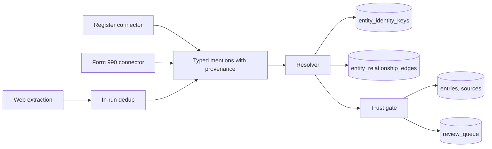

# Discovery Entity Resolution

Status: Implemented, awaiting staging validation. Date: 2026-09-13.

This plan is for whoever implements or reviews discovery's path from a source to
a published record. It brings the discovery pipeline in line with the resolution
order already specified in
[analysis-and-resolution-pipeline.md](../design/firehose/analysis-and-resolution-pipeline.md),
which discovery never followed.

## Why

On 2026-09-12 a new connector read officers from IRS Form 990 returns and
published 1,521 people in a day. Visitors then found banks listed as people, a
resignation note published as part of a name, and a profile label that invented
a role for every person. Each was patched on its own, and each patch was a
symptom of one structural gap: discovery turns every source mention directly
into a published record without resolving it first.

The evidence is in the database. `entity_identity_keys` held 1 row, although all
1,355 register organizations arrived with an EIN. `entity_relationship_edges`
held 0 rows, although 1,521 officers were published; each one's organization
survived only inside a sentence of description. Records were matched on name and
city alone.

The defects fall into four categories, and the resolution stage below exists to
close each category rather than its visible instances:

| Category    | Instances seen                                                                                               | What was missing                                                                    |
| ----------- | ------------------------------------------------------------------------------------------------------------ | ----------------------------------------------------------------------------------- |
| Type        | Banks published as people                                                                                    | The row's own typing: `PersonNm` vs `BusinessName`, `InstitutionalTrusteeInd`       |
| Identity    | Same-name people merge in a city; one person on three boards becomes three                                   | Stable identifiers (EIN) and person-within-organization matching                    |
| Currency    | "RESIGNED" in names; old roles shown as current                                                              | Roles as dated relationships from the tax period and `FormerOfcrDirectorTrusteeInd` |
| Attribution | Invented "Community organizer"; Atlas text shown as a ProPublica quote; corroboration guessed from URL shape | Provenance on every claim and relationship                                          |

The 1,469 filing-derived people were unpublished on 2026-09-13 and production
discovery schedules were disabled until this ships. Nothing was deleted.

## Decisions

Discovery resolves mentions before it persists anything. A source produces typed
mentions, resolution links each mention to an existing entry or proposes a new
one, and the trust gate decides publication from the resolution result rather
than from a record's text or its citation's URL.

Type is taken from the source's structure first. A filing row whose name sits in
`BusinessName` names an organization and yields no person. A `PersonNm` row
flagged `InstitutionalTrusteeInd` contradicts itself (observed in real returns)
and holds as `type_conflict`. Form 990-EZ and 990-PF rows carry no boxes, so a
bank a filer typed into `PersonNm` there has no structural signal. For that case
a `PersonNm` row is also checked with datamade's `probablepeople`, which was
trained on campaign-finance donor names, and a row it does not classify as a
person holds as `type_conflict`. The check can hold a row but never publish one.
Against the 1,469 held names it flagged 49. About 14 were real defects the
earlier regexes missed, such as "Ross Chapin until summer 2024" and "LAUREN
DEBELL TERM END 524". The other 35 or so were ordinary names like "Martin
Jacobs" that a reviewer releases. This replaces the designator regex added on
2026-09-13.

Identity follows the design document's order. Organizations resolve on EIN
through `entity_identity_keys`, and the key is written the first time an EIN is
seen. A person named on a return resolves only within that organization: the
same normalized name holding an edge to the same organization is the same
person. The same name at two organizations becomes two records plus a review
item, because the design forbids silently merging similar-named people.

A role is a relationship, not a description. Each officer row writes an
`entity_relationship_edges` row from person to organization, typed from the
row's flags (`officer`, `board_member`, `staff`, or `officer_or_director` for
990-EZ and 990-PF rows, which have no boxes), with the title as evidence, the
return as source, and the tax period end as `first_seen` and `last_seen`. An
older return read later never moves `last_seen` back. A role is current when the
return's tax period ended within two years and the return neither sets
`FormerOfcrDirectorTrusteeInd` nor states the departure in the title. Former and
stale roles are still recorded, as history.

The gate publishes a person only when resolution produced a certain type, an
unambiguous identity, and a current role backed by the return. It publishes an
organization when resolution matched or created it from a register EIN. Anything
else holds with a named reason: `type_conflict`, `identity_ambiguous`,
`no_current_role`. Each run re-applies the gate, so a person held for a stale
return publishes once a newer return lists them. A hold never unpublishes a
public record; it queues the record for review, once per record and reason. A
curator's rejection and a pending duplicate hold are never lifted by a run.

Web extraction no longer treats a registry URL as corroboration. Before this
change, anything a model extracted from a fetched ProPublica page would have
published as if the register had vouched for it.

People stored before relationships existed, including the 1,469 held on
2026-09-13, are found again because the resolver also matches a same-named
person who already cites one of the organization's returns.

Display names are normalized for reading with the `nameparser` library, which
handles Mc, Mac, O' and hyphenated names; the filer's original spelling stays on
the source.

## Pipeline

A component view of discovery inside the API after this change:

## Rollout

Every step runs on staging first, whose database is separate from production's
and currently empty. Push to `main` deploys staging. A staging discovery run for
two states is inspected directly in the staging database for: zero institutions
typed as people, zero former officers public, every published person holding a
current edge, EIN keys on every register organization, and same-name people at
different organizations kept apart. Only then is a production release tagged,
production schedules re-enabled, and the held people re-derived through the new
path.

## Open questions

The currency window is 24 months after a return's tax period ended. Nonprofits
file up to 10.5 months after year end, so a shorter window drops current filers,
and a longer one publishes boards that have turned over. Staging output should
decide whether it moves.

Register research summaries still list only web leads. Resolved records count
toward a run's statistics but do not appear among its ranked leads.

Cross-organization identity for people, meaning one person on several boards, is
deliberately not automated. It needs evidence beyond a name, such as the same
address block on both returns, and is out of scope here.

Web-extracted people keep the existing hold-for-review rule; this plan gives
them typed mentions and domain-key resolution but no new publication path.
